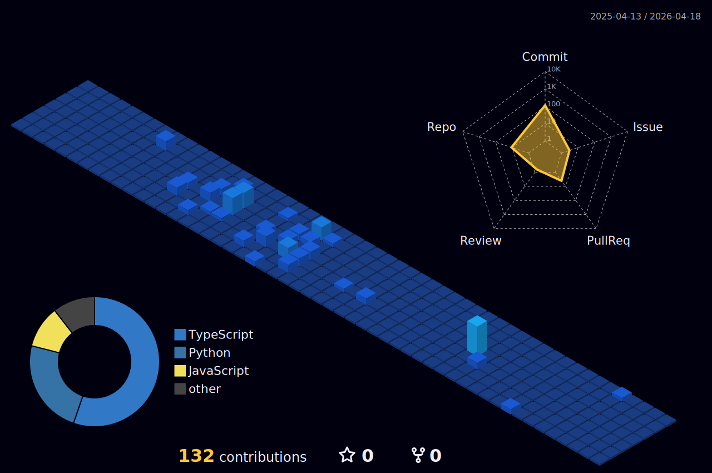

   

 
  <h2 style="border-bottom: 1px solid #d8dee4; color: #282d33;"> About </h2>  
   
  
 me 
 

 
  <h2 style="border-bottom: 1px solid #d8dee4; color: #282d33;"> 🛠️ Tech Stacks </h2>   
  
 

 
  <h2 style="border-bottom: 1px solid #d8dee4; color: #282d33;"> 🏅 Stats </h2> 
  
 - 
 
  

     

      
     

  

